

<a href="https://abhishek-thakur.com.np"></a>
<a href="https://www.linkedin.com/in/abhishek0948/"></a>


 


<a href="https://neptwone.onrender.com/"></a>
<a href="https://ai-web-doctor.onrender.com/"></a>
<a href="https://lafzloom.onrender.com/"></a>

 





